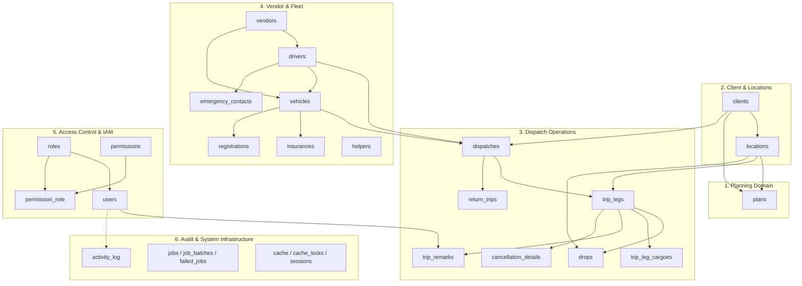
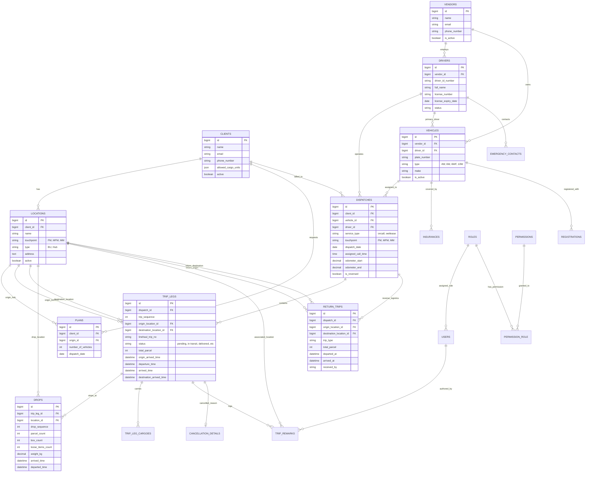

# Transport System - Database Architecture & Schema Documentation

> **Database:** `transportdb`  
> **Engine:** MySQL (InnoDB) / MariaDB  
> **Framework:** Laravel 13 (Modular via `nwidart/laravel-modules`)

This document provides a comprehensive overview, entity-relationship diagrams (ERD), domain mappings, and data dictionary for the Transport System application.

---

## 1. High-Level Domain Architecture

The Transport System database is organized into six core functional domains:



---

## 2. Entity-Relationship Diagram (ERD)

### 2.1 Core Operational ERD

The diagram below highlights the primary operational relationships between Clients, Locations, Plans, Dispatches, Trip Legs, Drops, and Fleet entities.



---

## 3. Module & Table Catalog

### 3.1 Planning Module (`Modules/Planning`)
Manages daily target plans for clients and origin hubs. Dispatches are fulfilled against these plans.

#### `plans`
Tracks daily vehicle quotas required per client and origin warehouse/hub.

| Column | Type | Nullable | Key / Constraint | Description |
|---|---|---|---|---|
| `id` | `bigint unsigned` | No | PK | Primary Key |
| `client_id` | `bigint unsigned` | No | FK -> `clients(id)` | Associated client |
| `origin_id` | `bigint unsigned` | No | FK -> `locations(id)` | Origin facility / hub where vehicles report |
| `number_of_vehicles` | `int` | No | | Target vehicle count planned for this route/date |
| `dispatch_date` | `date` | No | | Target scheduled dispatch date |
| `created_at` | `timestamp` | Yes | | Record creation timestamp |
| `updated_at` | `timestamp` | Yes | | Record last update timestamp |

---

### 3.2 Dispatch Operations Module (`Modules/DispatchOperation`)
Handles vehicle dispatches, multi-stop linehaul trip legs, drops, cargo breakdown, cancellation reasons, and reverse/return trips.

#### `dispatches`
Represents an individual vehicle dispatch assignment for a driver on a specific date.

| Column | Type | Nullable | Key / Constraint | Description |
|---|---|---|---|---|
| `id` | `bigint unsigned` | No | PK | Primary Key |
| `client_id` | `bigint unsigned` | No | FK -> `clients(id)` | Client assigned to this dispatch |
| `vehicle_id` | `bigint unsigned` | No | FK -> `vehicles(id)` | Vehicle assigned |
| `driver_id` | `bigint unsigned` | No | FK -> `drivers(id)` | Driver assigned |
| `service_type` | `varchar(255)` | No | Enum: `oncall`, `wetlease` | Dispatch commercial service contract type |
| `touchpoint` | `varchar(255)` | Yes | Enum: `FM`, `MFM`, `MM` | First Mile / Mid-First Mile / Middle Mile touchpoint |
| `dispatch_date` | `date` | No | | Scheduled date of dispatch |
| `assigned_call_time` | `time` | No | | Required call / staging time for the driver |
| `odometer_start` | `decimal(10,2)` | Yes | | Starting odometer reading of dispatch |
| `odometer_end` | `decimal(10,2)` | Yes | | Final ending odometer reading of dispatch |
| `is_reversed` | `tinyint(1)` | No | Default: `0` | Flag indicating if return/reverse trip was spawned |
| `created_at` | `timestamp` | Yes | | Record creation timestamp |
| `updated_at` | `timestamp` | Yes | | Record last update timestamp |

#### `trip_legs`
Individual journey legs belonging to a dispatch (Origin $\to$ Intermediate stops $\to$ Destination).

| Column | Type | Nullable | Key / Constraint | Description |
|---|---|---|---|---|
| `id` | `bigint unsigned` | No | PK | Primary Key |
| `dispatch_id` | `bigint unsigned` | No | FK -> `dispatches(id)` | Parent dispatch |
| `trip_sequence` | `int` | No | | Leg order in multi-leg trip (1, 2, 3...) |
| `origin_location_id` | `bigint unsigned` | Yes | FK -> `locations(id)` | Origin facility for this leg |
| `destination_location_id` | `bigint unsigned` | Yes | FK -> `locations(id)` | Final destination facility for this leg |
| `linehaul_trip_no` | `varchar(255)` | Yes | | Client linehaul trip tracking number / waybill # |
| `status` | `varchar(255)` | No | Default: `pending` | Trip status lifecycle (see Enums below) |
| `total_parcel` | `int` | Yes | | Total parcel count loaded for this leg |
| `odometer_start` | `decimal(10,2)` | Yes | | Leg starting odometer reading |
| `odometer_end` | `decimal(10,2)` | Yes | | Leg ending odometer reading |
| `origin_arrived_time` | `datetime` | Yes | | Timestamp when driver reached origin facility |
| `origin_start_loading_time`| `datetime` | Yes | | Timestamp when loading commenced at origin |
| `origin_end_loading_time`  | `datetime` | Yes | | Timestamp when loading finished at origin |
| `departure_time` | `datetime` | Yes | | Actual departure timestamp from origin |
| `arrived_time` | `datetime` | Yes | | In-transit arrival checkpoint |
| `destination_arrived_time` | `datetime` | Yes | | Timestamp when driver reached destination |
| `destination_start_unloading_time` | `datetime` | Yes | | Timestamp when unloading commenced |
| `destination_end_unloading_time`   | `datetime` | Yes | | Timestamp when unloading finished |
| `destination_departed_time`        | `datetime` | Yes | | Timestamp when departing destination |
| `end_time` | `datetime` | Yes | | Leg completion timestamp |
| `created_at` | `timestamp` | Yes | | Creation timestamp |
| `updated_at` | `timestamp` | Yes | | Last update timestamp |

#### `drops`
Intermediate drop-off locations along a trip leg.

| Column | Type | Nullable | Key / Constraint | Description |
|---|---|---|---|---|
| `id` | `bigint unsigned` | No | PK | Primary Key |
| `trip_leg_id` | `bigint unsigned` | No | FK -> `trip_legs(id)` | Parent trip leg |
| `location_id` | `bigint unsigned` | No | FK -> `locations(id)` | Drop facility / branch location |
| `drop_sequence` | `int` | No | | Sequence order of this drop stop |
| `parcel_count` | `int` | Yes | | Number of individual parcels dropped |
| `box_count` | `int` | Yes | | Number of boxes/cartons dropped |
| `loose_items_count` | `int` | Yes | | Loose items dropped |
| `weight_kg` | `decimal(10,2)` | Yes | | Weight dropped in kilograms |
| `arrived_time` | `datetime` | Yes | | Arrival at drop stop |
| `departed_time` | `datetime` | Yes | | Departure from drop stop |
| `created_at` | `timestamp` | Yes | | Creation timestamp |
| `updated_at` | `timestamp` | Yes | | Last update timestamp |

#### `trip_leg_cargoes`
Cargo volume and categorization for a trip leg.

| Column | Type | Nullable | Key / Constraint | Description |
|---|---|---|---|---|
| `id` | `bigint unsigned` | No | PK | Primary Key |
| `trip_leg_id` | `bigint unsigned` | No | FK -> `trip_legs(id)` | Parent trip leg |
| `cargo_type` | `varchar(255)` | No | | Cargo category / unit (e.g. Pallets, Bags, Crates) |
| `quantity` | `int` | No | | Quantity loaded |
| `remarks` | `text` | Yes | | Specific cargo handling notes |
| `created_at` | `timestamp` | Yes | | Creation timestamp |
| `updated_at` | `timestamp` | Yes | | Last update timestamp |

#### `trip_remarks`
Milestone remarks and operational comments during trip execution.

| Column | Type | Nullable | Key / Constraint | Description |
|---|---|---|---|---|
| `id` | `bigint unsigned` | No | PK | Primary Key |
| `trip_leg_id` | `bigint unsigned` | No | FK -> `trip_legs(id)` | Associated trip leg |
| `location_id` | `bigint unsigned` | Yes | FK -> `locations(id)` | Relevant location when remark occurred |
| `user_id` | `bigint unsigned` | Yes | FK -> `users(id)` | Operator / user who posted remark |
| `remark` | `text` | No | | Operational comment / note text |
| `created_at` | `timestamp` | Yes | | Creation timestamp |
| `updated_at` | `timestamp` | Yes | | Last update timestamp |

#### `cancellation_details`
Formal record of cancellation or foul trips.

| Column | Type | Nullable | Key / Constraint | Description |
|---|---|---|---|---|
| `id` | `bigint unsigned` | No | PK | Primary Key |
| `trip_leg_id` | `bigint unsigned` | No | FK -> `trip_legs(id)` | Cancelled trip leg |
| `detail` | `varchar(255)` | No | Enum: `CancellationDetailsEnum` | Standard reason code (Breakdown, Refusal, etc.) |
| `remarks` | `text` | Yes | | Additional justification / incident report |

#### `return_trips`
Reverse logistics and return trips from destination back to origin or depot.

| Column | Type | Nullable | Key / Constraint | Description |
|---|---|---|---|---|
| `id` | `bigint unsigned` | No | PK | Primary Key |
| `dispatch_id` | `bigint unsigned` | No | FK -> `dispatches(id)` | Original dispatch |
| `trip_type` | `varchar(255)` | No | | Return trip type (e.g. Empty Return, Backhaul) |
| `origin_location_id` | `bigint unsigned` | No | FK -> `locations(id)` | Return origin |
| `destination_location_id` | `bigint unsigned` | No | FK -> `locations(id)` | Return destination |
| `odometer_start` | `decimal(10,2)` | Yes | | Starting odometer |
| `odometer_end` | `decimal(10,2)` | Yes | | Ending odometer |
| `total_parcel` | `int` | Yes | | Total parcels returned |
| `box_count` | `int` | Yes | | Boxes returned |
| `loose_items_count` | `int` | Yes | | Loose items returned |
| `weight_kg` | `decimal(10,2)` | Yes | | Return cargo weight (kg) |
| `departed_at` | `datetime` | Yes | | Return departure timestamp |
| `arrived_at` | `datetime` | Yes | | Return arrival timestamp |
| `received_by` | `varchar(255)` | Yes | | Receiving officer signature / name |
| `created_at` | `timestamp` | Yes | | Creation timestamp |
| `updated_at` | `timestamp` | Yes | | Last update timestamp |

---

### 3.3 Client & Locations Module (`Modules/Client`)

#### `clients`
Shippers, logistics partners, and commercial accounts.

| Column | Type | Nullable | Key / Constraint | Description |
|---|---|---|---|---|
| `id` | `bigint unsigned` | No | PK | Primary Key |
| `name` | `varchar(255)` | No | | Client company name |
| `email` | `varchar(255)` | Yes | | Primary contact email |
| `phone_number` | `varchar(255)` | Yes | | Contact phone number |
| `allowed_cargo_units` | `json` | Yes | | JSON array of valid cargo units for this client |
| `active` | `tinyint(1)` | No | Default: `1` | Active status flag |
| `created_at` | `timestamp` | Yes | | Creation timestamp |
| `updated_at` | `timestamp` | Yes | | Last update timestamp |

#### `locations`
Physical hubs, business units, sorting centers, warehouses, and client branches.

| Column | Type | Nullable | Key / Constraint | Description |
|---|---|---|---|---|
| `id` | `bigint unsigned` | No | PK | Primary Key |
| `client_id` | `bigint unsigned` | No | FK -> `clients(id)` | Owner / tenant client |
| `name` | `varchar(255)` | No | | Location name / facility identifier |
| `touchpoint` | `varchar(255)` | Yes | Enum: `FM`, `MFM`, `MM` | Touchpoint classification |
| `type` | `varchar(255)` | Yes | Enum: `BU`, `Hub` | Location facility type |
| `address` | `text` | Yes | | Street address and coordinates notes |
| `active` | `tinyint(1)` | No | Default: `1` | Active facility flag |
| `created_at` | `timestamp` | Yes | | Creation timestamp |
| `updated_at` | `timestamp` | Yes | | Last update timestamp |

---

### 3.4 Vendor & Fleet Management Module (`Modules/Vendor`)

#### `vendors`
Third-party transport providers, trucking subcontractors, or internal fleet entities.

| Column | Type | Nullable | Key / Constraint | Description |
|---|---|---|---|---|
| `id` | `bigint unsigned` | No | PK | Primary Key |
| `name` | `varchar(255)` | No | | Vendor / company name |
| `email` | `varchar(255)` | Yes | | Contact email |
| `phone_number` | `varchar(255)` | Yes | | Contact phone |
| `is_active` | `tinyint(1)` | No | Default: `1` | Active status flag |
| `created_at` | `timestamp` | Yes | | Creation timestamp |
| `updated_at` | `timestamp` | Yes | | Last update timestamp |

#### `drivers`
Licensed drivers operated by vendors or internal fleet.

| Column | Type | Nullable | Key / Constraint | Description |
|---|---|---|---|---|
| `id` | `bigint unsigned` | No | PK | Primary Key |
| `vendor_id` | `bigint unsigned` | No | FK -> `vendors(id)` | Employer / contracting vendor |
| `driver_id_number` | `varchar(255)` | Yes | | Internal employee / contractor code |
| `full_name` | `varchar(255)` | No | | Driver complete name |
| `birthday` | `date` | Yes | | Date of birth |
| `gender` | `varchar(255)` | Yes | Enum: `Male`, `Female` | Gender |
| `phone_number` | `varchar(255)` | Yes | | Contact number |
| `address` | `text` | Yes | | Residential address |
| `license_number` | `varchar(255)` | No | | Driver's professional license number |
| `license_expiry_date`| `date` | No | | Driver's license expiration date |
| `status` | `varchar(255)` | No | Enum: `DriverStatusEnum` | Employment status (Active, Inactive, Resigned...) |
| `created_at` | `timestamp` | Yes | | Creation timestamp |
| `updated_at` | `timestamp` | Yes | | Last update timestamp |

#### `vehicles`
Trucks and transport assets.

| Column | Type | Nullable | Key / Constraint | Description |
|---|---|---|---|---|
| `id` | `bigint unsigned` | No | PK | Primary Key |
| `vendor_id` | `bigint unsigned` | No | FK -> `vendors(id)` | Owning vendor |
| `driver_id` | `bigint unsigned` | Yes | FK -> `drivers(id)` | Assigned dedicated driver |
| `plate_number` | `varchar(255)` | No | Unique | Vehicle license plate number |
| `type` | `varchar(255)` | No | Enum: `4W`, `6W`, `6WF`, `10W` | Vehicle axle / truck body type |
| `make` | `varchar(255)` | Yes | | Brand / manufacturer (e.g. Isuzu, Fuso) |
| `engine_number` | `varchar(255)` | Yes | | Vehicle engine serial number |
| `chassis_number` | `varchar(255)` | Yes | | Vehicle chassis / VIN number |
| `year_model` | `varchar(255)` | Yes | | Manufacturing year model |
| `owners_name` | `varchar(255)` | Yes | | Registered owner on official papers |
| `registered_address` | `text` | Yes | | Address on vehicle registration |
| `is_active` | `tinyint(1)` | No | Default: `1` | Active operational status |
| `created_at` | `timestamp` | Yes | | Creation timestamp |
| `updated_at` | `timestamp` | Yes | | Last update timestamp |

#### `registrations`
Official government registration and franchise documents (LTO CR/OR, LTFRB CPC).

| Column | Type | Nullable | Key / Constraint | Description |
|---|---|---|---|---|
| `id` | `bigint unsigned` | No | PK | Primary Key |
| `vehicle_id` | `bigint unsigned` | No | FK -> `vehicles(id)` | Associated vehicle |
| `cr_number` | `varchar(255)` | Yes | | Certificate of Registration (CR) # |
| `cr_date` | `date` | Yes | | CR issuance date |
| `or_number` | `varchar(255)` | Yes | | Official Receipt (OR) # |
| `or_date` | `date` | Yes | | OR payment validity date |
| `ltfrb_date` | `date` | Yes | | LTFRB franchise validity date |
| `case_number` | `varchar(255)` | Yes | | LTFRB franchise CPC case number |
| `created_at` | `timestamp` | Yes | | Creation timestamp |
| `updated_at` | `timestamp` | Yes | | Last update timestamp |

#### `insurances`
Vehicle comprehensive and third-party liability insurance coverage.

| Column | Type | Nullable | Key / Constraint | Description |
|---|---|---|---|---|
| `id` | `bigint unsigned` | No | PK | Primary Key |
| `vehicle_id` | `bigint unsigned` | No | FK -> `vehicles(id)` | Covered vehicle |
| `provider_name` | `varchar(255)` | No | | Insurance company name |
| `policy_number` | `varchar(255)` | No | | Insurance policy number |
| `start_date` | `date` | No | | Policy effective date |
| `end_date` | `date` | No | | Policy expiration date |
| `created_at` | `timestamp` | Yes | | Creation timestamp |
| `updated_at` | `timestamp` | Yes | | Last update timestamp |

#### `emergency_contacts`
Next of kin / emergency contacts for drivers.

| Column | Type | Nullable | Key / Constraint | Description |
|---|---|---|---|---|
| `id` | `bigint unsigned` | No | PK | Primary Key |
| `driver_id` | `bigint unsigned` | No | FK -> `drivers(id)` | Driver |
| `full_name` | `varchar(255)` | No | | Contact person full name |
| `phone_number` | `varchar(255)` | No | | Contact phone number |
| `created_at` | `timestamp` | Yes | | Creation timestamp |
| `updated_at` | `timestamp` | Yes | | Last update timestamp |

#### `helpers`
Logistics helpers / crew assisting drivers with cargo handling.

| Column | Type | Nullable | Key / Constraint | Description |
|---|---|---|---|---|
| `id` | `bigint unsigned` | No | PK | Primary Key |
| `full_name` | `varchar(255)` | No | | Helper full name |
| `phone_number` | `varchar(255)` | Yes | | Contact number |
| `is_active` | `tinyint(1)` | No | Default: `1` | Active employment flag |
| `created_at` | `timestamp` | Yes | | Creation timestamp |
| `updated_at` | `timestamp` | Yes | | Last update timestamp |

---

### 3.5 Identity & Access Management (IAM)

#### `users`
System accounts for dispatchers, planners, managers, and administrators.

| Column | Type | Nullable | Key / Constraint | Description |
|---|---|---|---|---|
| `id` | `bigint unsigned` | No | PK | Primary Key |
| `name` | `varchar(255)` | No | | User display name |
| `email` | `varchar(255)` | No | Unique | Login email address |
| `email_verified_at`| `timestamp` | Yes | | Email verification timestamp |
| `password` | `varchar(255)` | No | | Hashed password |
| `role_id` | `bigint unsigned` | Yes | FK -> `roles(id)` | Assigned system role |
| `remember_token` | `varchar(100)` | Yes | | Authentication remember token |
| `created_at` | `timestamp` | Yes | | Account creation timestamp |
| `updated_at` | `timestamp` | Yes | | Account update timestamp |

#### `roles`
Role definitions (e.g. Admin, Dispatcher, Planner, Viewer).

| Column | Type | Nullable | Key / Constraint | Description |
|---|---|---|---|---|
| `id` | `bigint unsigned` | No | PK | Primary Key |
| `name` | `varchar(255)` | No | | Role human-readable name |
| `slug` | `varchar(255)` | No | Unique | Normalized role identifier |
| `description` | `text` | Yes | | Role scope description |
| `created_at` | `timestamp` | Yes | | Creation timestamp |
| `updated_at` | `timestamp` | Yes | | Last update timestamp |

#### `permissions`
Granular feature permissions.

| Column | Type | Nullable | Key / Constraint | Description |
|---|---|---|---|---|
| `id` | `bigint unsigned` | No | PK | Primary Key |
| `name` | `varchar(255)` | No | | Permission name |
| `slug` | `varchar(255)` | No | Unique | Permission slug code |
| `created_at` | `timestamp` | Yes | | Creation timestamp |
| `updated_at` | `timestamp` | Yes | | Last update timestamp |

#### `permission_role`
Pivot table defining CRUD matrix per role.

| Column | Type | Nullable | Key / Constraint | Description |
|---|---|---|---|---|
| `id` | `bigint unsigned` | No | PK | Primary Key |
| `role_id` | `bigint unsigned` | No | FK -> `roles(id)` | Target role |
| `permission_id` | `bigint unsigned` | No | FK -> `permissions(id)` | Target permission |
| `view` | `tinyint(1)` | No | Default: `0` | Can view records |
| `create` | `tinyint(1)` | No | Default: `0` | Can create records |
| `edit` | `tinyint(1)` | No | Default: `0` | Can modify records |
| `delete` | `tinyint(1)` | No | Default: `0` | Can delete records |
| `created_at` | `timestamp` | Yes | | Creation timestamp |
| `updated_at` | `timestamp` | Yes | | Last update timestamp |

---

### 3.6 System Infrastructure & Audit Logging

| Table | Purpose | Key Columns |
|---|---|---|
| `activity_log` | Spatie Activity Log recording changes to entities across the app | `id`, `log_name`, `description`, `subject_type`, `subject_id`, `event`, `causer_type`, `causer_id`, `properties` |
| `sessions` | Web user session state storage (database driver) | `id`, `user_id`, `ip_address`, `user_agent`, `payload`, `last_activity` |
| `password_reset_tokens` | Fortify / Laravel password reset verification | `email`, `token`, `created_at` |
| `jobs` | Asynchronous queue worker jobs | `id`, `queue`, `payload`, `attempts`, `reserved_at`, `available_at`, `created_at` |
| `job_batches` | Batch queue execution records | `id`, `name`, `total_jobs`, `pending_jobs`, `failed_jobs`, `failed_job_ids`, `options` |
| `failed_jobs` | Queue jobs that exceeded retry attempts or encountered unhandled exceptions | `id`, `uuid`, `connection`, `queue`, `payload`, `exception`, `failed_at` |
| `cache` / `cache_locks` | Database cache driver keys and distributed locks | `key`, `value`, `expiration` |
| `migrations` | Laravel database schema migration versions tracker | `id`, `migration`, `batch` |

---

## 4. Key Business Logic & Enums Reference

### 4.1 Trip Status Progression (`TripStatus`)
Trip legs follow a milestone progression:

```
[ pending ] 
     │
     ▼
[ intransit to origin ]
     │
     ▼
[ waiting at parking ] 
     │
     ▼
[ ongoing loading ]
     │
     ▼
[ in transit to destination ]
     │
     ├─► [ waiting for unloading ]
     │        │
     │        ▼
     │   [ ongoing unloading ]
     │        │
     │        ▼
     │   [ delivered ]  (Final Success State)
     │
     ├─► [ waiting for soc ] (Stationary Operational Check)
     │
     ├─► [ foul trip ]       (Foul / Rejected Delivery)
     │
     └─► [ cancelled ]       (Cancelled before/during transit)
```

### 4.2 Enums Summary Table

| Enum Class | DB Table & Column | Valid Cases / Values |
|---|---|---|
| `TripStatus` | `trip_legs.status` | `pending`, `intransit to origin`, `waiting at parking`, `ongoing loading`, `in transit to destination`, `waiting for unloading`, `waiting for soc`, `ongoing unloading`, `delivered`, `foul trip`, `cancelled` |
| `ServiceType` | `dispatches.service_type` | `oncall`, `wetlease` |
| `TouchpointType` | `dispatches.touchpoint`, `locations.touchpoint` | `FM` (First Mile), `MFM` (Mid-First Mile), `MM` (Middle Mile) |
| `LocationType` | `locations.type` | `BU` (Business Unit), `Hub` (Logistics Distribution Hub) |
| `VehicleType` | `vehicles.type` | `4W` (4-Wheeler), `6W` (6-Wheeler), `6WF` (6-Wheeler Forward), `10W` (10-Wheeler) |
| `DriverStatusEnum` | `drivers.status` | `Active`, `Back-out`, `Deactivated`, `For Account Creation`, `For Modification`, `Inactive`, `Resigned`, `Suspended Stuck-Up`, `Temporary Stop Hiring`, `Under Assesment` |
| `CancellationDetailsEnum` | `cancellation_details.detail` | `refusal of trip`, `coding`, `vehicle breakdown`, `personnel on leave`, `resigned`, `cancelled by client`, `not available`, `rescue urgent`, `water leak`, `client app issue`, `due to bad`, `driver not available`, `unrecognized`, `apprehended by enforcement` |
